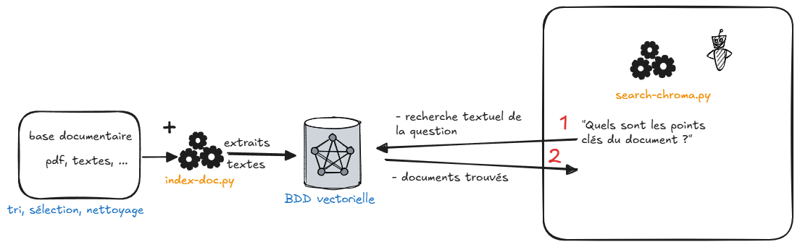

# Expérimentation base vectorielle - sans LLM de réponse

## Raggy Nano RAG

Expérimentation d'indexation d'un document PDF dans une base Chroma, question sur cette BDD et obtention des documents issus de Chroma.

Le RAG Chroma utilise le modèle CamemBERT pour l'indexation et la recherche.

Pour apprentissage API de la lib Chroma.

Basé sur [ChatSO recherche](https://gitlab.in2p3.fr/ateliersdeladonneesgt1/chatbot-recherche/) (il faut avoir un compte ESR) 

## Prérequis

### Initialisation venv

Installe pytorch avec le support GPU CUDA

```bash
$ virtualenv env
$ source env/Scripts/activate
$ pip install -r requirements.txt
```

## Etapes

### 1- Constitution base vectorielle : index-doc.py

- PDF : extraction en "chunks" de texte (extraits)
- BDD : stockage des extraits dans ChromaDb placé dans le répertoire `CHROMA_DB`

Indexation d'un document PDF en vecteurs / embeddings : 15 s

```bash
$ python index-doc.py # lit et index document.pdf
```

### 2- Recherche dans la base ChromaDb sous forme de questions / documents trouvés

```bash
$ python search-chroma.py # recherche dans la base indexée
```

Temps d'exécution :

- Chroma chargement : 0,20 s
- Recherche de documents sur la phrase "Quels sont les points clés du document ?" : 10 s

Basé sur [ChatSO recherche](https://gitlab.in2p3.fr/ateliersdeladonneesgt1/chatbot-recherche/) 

-----------------

### Résultat de la question

**Question :** Quels sont les points clés du document ?

**Extraits de ChromaDb trouvés**

```
Extraits de ChromaDb trouvés

Question : Quels sont les points clés du document ?

Documents : surnoms blessants, mises à l’écart…).

- L’intention : Souvent les harceleurs disent qu’ils agissent « juste
pour rire ». Mais derrière cette prétendue rigolade, ils ont surtout envie
de montrer leur pouvoir ou d’exercer leur force ! Parfois ils veulent
juste faire souffrir quelqu’un, sans aucune raison.

- La répétition : Le harcèlement, c’est la répétition d’une multitude de
petites attaques. Comme une goutte d’eau qui fuit du robinet et ne C’est quoi le harcèlement ?

CA FAIT MAL !
Le harcèlement à l’école, ce sont des violences répétées par un ou plusieurs
élèves contre un/une autre camarade. Le ou les agresseurs agissent pour le
dominer, le blesser et l’exclure. On parle de harcèlement quand on retrouve
ces 4 éléments :
- La violence : Ce sont parfois des actes très graves (insultes, coups,
vols, etc.) mais aussi des gestes qui paraissent plus banals (moqueries,
surnoms blessants, mises à l’écart…). petites attaques. Comme une goutte d’eau qui fuit du robinet et ne
s’arrête jamais. Séparément, ces actes ne paraissent pas graves. Mais
répétés, ils blessent. Avec le temps, ils deviennent de plus en plus
violents.

- L’isolement : C’est à la fois une cause et une conséquence. Un/Une
enfant peut être harcelé(e) parce qu’il/elle est différent(e) des autres
(trop grand(e), trop bizarre, trop machin, trop truc…), mais aussi parce

```

### Schéma des traitements



source : https://excalidraw.com/#json=smwavH3tIGB0qDT7FrX8A,WQnJFBnpYJ_Rbik9JzlT-A
