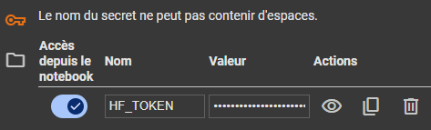
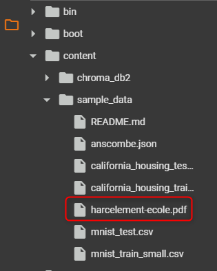
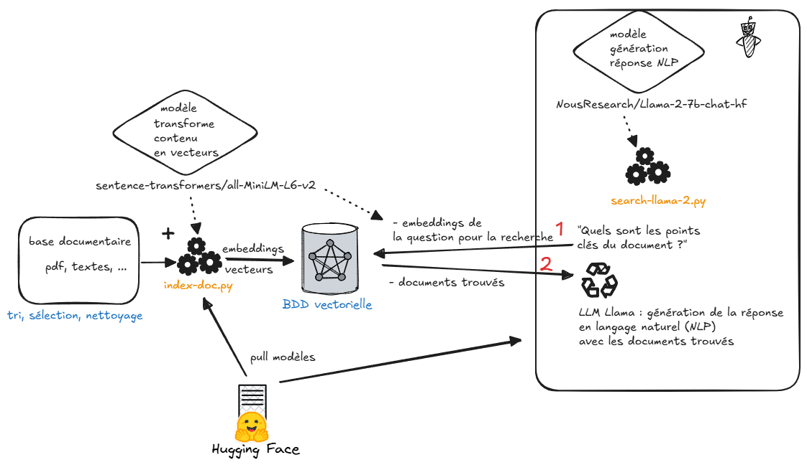

# LLM & RAG LLAMA 2 expérimentation

## Raggy Nano RAG

Expérimentation de création d'un nano RAG à partir d'un PDF puis question / réponse

## Prérequis

### NVidia et CUDA

PyTorch est installé avec CUDA (cf. requirements.txt).

Sous Windows, pour la prise en compte de CUDA, cela demandera peut-être d'installer le [CUDA Toolkit 12.8](https://developer.nvidia.com/cuda-downloads?target_os=Windows&target_arch=x86_64&target_version=10&target_type=exe_local) 

Vérifier que CUDA est bien pris en charge par PyTorch, après installation des packages (cf. Initialisation venv plus bas) :

```bash
$ python
>>> import torch
>>> torch.cuda.is_available()
True
>>> exit()
```
 

### HuggingFace

HuggingFace, un hub, est utilisé pour le modèle de langage et le modèle de recherche.

#### Compte Hugging Face & autorisation d'utilisation des modèles

Un compte Hugging Face et un token vont être nécessaire, et également une demande d'autorisation d'utilisation sur les espaces des modèles

- Se créer un compte : https://huggingface.co/
- Initialiser un token : https://huggingface.co/settings/tokens
- Se logger sur HF via le cli avec le token précédemment généré (https://huggingface.co/docs/huggingface_hub/en/guides/cli#huggingface-cli-login)

```bash
$ huggingface-cli login
Enter your token (input will not be visible):
```

Savoir si on est connecté à HG avec le cli (cf. ci-après)

```bash
$ huggingface-cli whoami
Not logged in
```

Les modèles utilisés (Llama 2) demandent une autorisation pour les conditions d'utilisation, directement sur les espaces concernés :

- NousResearch : https://huggingface.co/NousResearch/Llama-2-7b-chat-hf
- Meta : https://huggingface.co/meta-llama/Llama-2-7b-chat-hf

#### Cli Hugging Face

** /!\ attention, HuggingFace va puller les modèles utilisés et les stocker en local, cela peut représenter plusieurs Go ! /!\ **

Le CLI HF permet de vide son cache de modèles stockés sur le disque 
```bash
$ pip install -U "huggingface_hub[cli]"
```

Il demandera quels modèles à supprimer en sélectionnant le modèle à supprimer

```bash
$ huggingface-cli delete-cache

? Select revisions to delete: 0 revisions selected counting for 0.0.
❯ ○ None of the following (if selected, nothing will be deleted).

Model meta-llama/Llama-2-7b-chat-hf (13.5G, used 2 days ago)
  ○ f5db02db: main # modified 2 weeks ago

Model sentence-transformers/all-mpnet-base-v2 (438.7M, used 2 days ago)
  ○ 9a322596: main # modified 4 weeks ago

Model NousResearch/Llama-2-7b-chat-hf (13.5G, used 16 minutes ago)
  ○ 351844e7: main # modified 3 days ago

Model sentence-transformers/all-MiniLM-L6-v2 (91.6M, used 15 minutes ago)
  ○ fa97f6e7: main # modified 3 weeks ago

```

### Initialisation venv

Installe pytorch avec le support GPU CUDA

```bash
$ virtualenv env
$ source env/Scripts/activate
$ pip install -r requirements.txt
```

## Notebook sur Google Colab

/!\ Cela demandera un compte Google /!\

Un notebook est disponible pour l'expérimentation sur Google Colab, derrière c'est sur drive : https://colab.research.google.com/drive/1H-TrPLF6CD7rW4cpKcENFAShlnJvbN20#scrollTo=_PRfyBYWgO6B

### Initialisation du notebook

1- Le token d'accès HuggingFace doit être renseignée dans le notebook, sur HF : https://huggingface.co/settings/tokens

Pour retrouver la valeur de votre token initialisé avec le CLI HF : le fichier **token** dans `.cache\huggingface\token` (Windows)



2- Mettre le fichier kb/harcelement-scolaire.pdf dans le répertoire /content/sample_data/ du notebook ou vos datasets




### Performances

Améliorations avec **GPU T4 16 Go VRAM** (à activer )

- 10-15 tokens/sec - 75 sec d'inférence

## Etapes

### 1- Constitution base vectorielle avec un modèle opensource : index-doc.py

- PDF : extraction en "chunks" de texte (extraits)
- BDD : stockage des extraits dans ChromaDb placé dans le répertoire `chroma_db`

Indexation d'un document PDF : 25 s

```bash
$ python index-doc.py # lit et index document.pdf
```

### 2- Recherche dans la base ChromaDb sous forme de questions / réponses avec modèle de réponse Llama 2 : search-doc.py

```bash
$ python search-llama-2.py # recherche dans la base indexée
```

Temps d'exécution :

- initialisation modèle : 50 s
- Chroma chargement : 1,5 s
- Recherche / inférence sur la phrase "Quels sont les points clés du document ?" sur GPU :
  - 0,50 tokens/sec
  - 350 s (5 min 50 s)
    
-----------------

### Résultat de la question

**Question :** Quels sont les points clés du document ?

**Extraits de ChromaDb trouvés via les vecteurs / embeddings**

```
petites attaques. Comme une goutte d’eau qui fuit du robinet et ne
s’arrête jamais. Séparément, ces actes ne paraissent pas graves. Mais
répétés, ils blessent. Avec le temps, ils deviennent de plus en plus
violents.

- L’isolement : C’est à la fois une cause et une conséquence. Un/Une
enfant peut être harcelé(e) parce qu’il/elle est différent(e) des autres
(trop grand(e), trop bizarre, trop machin, trop truc…), mais aussi parce C’est quoi le harcèlement ?

CA FAIT MAL !
Le harcèlement à l’école, ce sont des violences répétées par un ou plusieurs
élèves contre un/une autre camarade. Le ou les agresseurs agissent pour le
dominer, le blesser et l’exclure. On parle de harcèlement quand on retrouve
ces 4 éléments :
- La violence : Ce sont parfois des actes très graves (insultes, coups,
vols, etc.) mais aussi des gestes qui paraissent plus banals (moqueries,
surnoms blessants, mises à l’écart…). (trop grand(e), trop bizarre, trop machin, trop truc…), mais aussi parce
qu’il/elle est seul(e) et n’as pas d’ami(e)s qui pourraient le/la défendre.
Harcelé(e), l’enfant risque d’être encore plus isolé(e) et fragile.

Le harcèlement, c’est le refus  de la différence !
```

**Génération de la réponse par Llama 2** qui crée un résumé, qui peut être différent à chaque exécution

```
Les points clés du document sont les suivants :

1. Le harcèlement est une violence répétée qui peut être causée par des raisons différentes, notamment l'isolement, la différence et la médiocrité.
2. Le harcèlement peut prendre des formes différentes, allant des moqueries et des surnoms blessants aux actes plus graves tels que les coups et les vols.
3. Le harcèlement peut être commis par un ou plusieurs agresseurs, et il peut avoir des conséquences graves pour la victime, notamment l'isolement et la blessure émotionnelle.
4. Le harcèlement est un refus de la différence, et il est important de comprendre et de lutter contre cette forme de violence.
```

```
Les points clés du document sont :

1. Le harcèlement est une violence répétée, qui peut être physique ou verbale, et qui peut avoir des conséquences graves sur la santé mentale et physique des victimes.
2. Le harcèlement peut prendre de nombreuses formes, notamment des moqueries, des insultes, des coups, des vols, etc.
3. Le harcèlement peut être commis par un ou plusieurs agresseurs, et peut être motivé par le désir de dominer, de blesser et d'exclure les victimes.
4. Le harcèlement peut être causé par des raisons telles que la différence de l'enfant harcelé par rapport à ses camarades, ou le fait qu'il est isolé et n'a pas d'amis qui pourraient le défendre
```

### Schéma des traitements



source : https://excalidraw.com/#json=C9Zef6EHk8ZdpQVKOZy_A,P-nk27znVP3vEhKJVEMh9Q  
