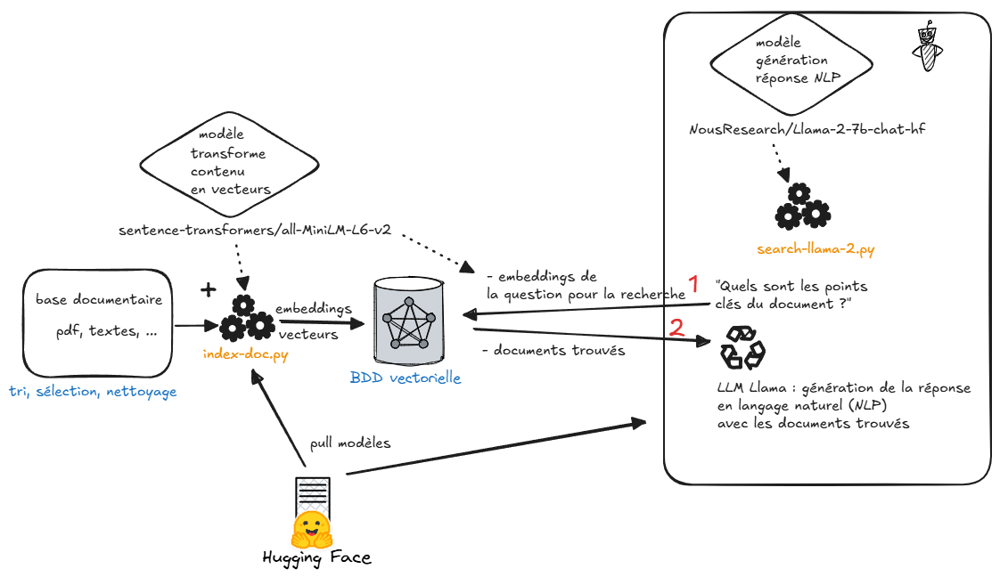

# LLM & RAG LLAMA 2 expérimentation

## Raggy Nano RAG

Expérimentation d'indexation d'un document PDF dans une base Chroma, question sur cette BDD et obtention des documents issus de Chroma.

## Prérequis
 

### HuggingFace

HuggingFace, un hub, est utilisé pour le modèle de langage et le modèle de recherche.

#### Compte Hugging Face

A priori, le token n'est pas nécessaire et donc pas de login à Hugging Face avec les modèles Opensource utilisés.

Si besoin :

- Se créer un compte : https://huggingface.co/
- Initialiser un token : https://huggingface.co/settings/tokens
- Se logger sur HF via le cli avec le token précédemment généré (https://huggingface.co/docs/huggingface_hub/en/guides/cli#huggingface-cli-login) 

```bash
$ huggingface-cli login
Enter your token (input will not be visible):
```

Savoir si on est connecté à HG avec le cli (cf. ci-après)

```bash
$ huggingface-cli whoami
Not logged in
```

#### Cli Hugging Face

** /!\ attention, HuggingFace va puller les modèles utilisés et les stocker en local, cela peut représenter plusieurs Go ! /!\ **

Le CLI HF permet de vide son cache de modèles stockés sur le disque 
```bash
$ pip install -U "huggingface_hub[cli]"
```

Il demandera quels modèles à supprimer en sélectionnant le modèle à supprimer

```bash
$ huggingface-cli delete-cache

? Select revisions to delete: 0 revisions selected counting for 0.0.
❯ ○ None of the following (if selected, nothing will be deleted).

Model meta-llama/Llama-2-7b-chat-hf (13.5G, used 2 days ago)
  ○ f5db02db: main # modified 2 weeks ago

Model sentence-transformers/all-mpnet-base-v2 (438.7M, used 2 days ago)
  ○ 9a322596: main # modified 4 weeks ago

Model NousResearch/Llama-2-7b-chat-hf (13.5G, used 16 minutes ago)
  ○ 351844e7: main # modified 3 days ago

Model sentence-transformers/all-MiniLM-L6-v2 (91.6M, used 15 minutes ago)
  ○ fa97f6e7: main # modified 3 weeks ago

```

### Initialisation venv

Installe pytorch avec le support GPU CUDA

```bash
$ virtualenv env
$ source env/Scripts/activate
$ pip install -r requirements.txt
```

## Etapes

### 1- Constitution base vectorielle avec un modèle opensource : index-doc.py

- PDF : extraction en "chunks" de texte (extraits)
- BDD : stockage des extraits dans ChromaDb placé dans le répertoire `chroma_db`

Indexation d'un document PDF en vecteurs / embeddings : 15 s

```bash
$ python index-doc.py # lit et index document.pdf
```

### 2- Recherche dans la base ChromaDb sous forme de questions / documents trouvés

```bash
$ python search-chroma.py # recherche dans la base indexée
```

Temps d'exécution :

- Chroma chargement : 0,25 s
- Recherche de documents sur la phrase "Quels sont les points clés du document ?" : 10 s
    
-----------------

### Résultat de la question

**Question :** Quels sont les points clés du document ?

**Extraits de ChromaDb trouvés via les vecteurs / embeddings**

```
Extraits de ChromaDb trouvés

Question : Quels sont les points clés du document ?

Documents : petites attaques. Comme une goutte d’eau qui fuit du robinet et ne
s’arrête jamais. Séparément, ces actes ne paraissent pas graves. Mais
répétés, ils blessent. Avec le temps, ils deviennent de plus en plus
violents.

- L’isolement : C’est à la fois une cause et une conséquence. Un/Une
enfant peut être harcelé(e) parce qu’il/elle est différent(e) des autres
(trop grand(e), trop bizarre, trop machin, trop truc…), mais aussi parce C’est quoi le harcèlement ?

CA FAIT MAL !
Le harcèlement à l’école, ce sont des violences répétées par un ou plusieurs
élèves contre un/une autre camarade. Le ou les agresseurs agissent pour le
dominer, le blesser et l’exclure. On parle de harcèlement quand on retrouve
ces 4 éléments :
- La violence : Ce sont parfois des actes très graves (insultes, coups,
vols, etc.) mais aussi des gestes qui paraissent plus banals (moqueries,
surnoms blessants, mises à l’écart…). (trop grand(e), trop bizarre, trop machin, trop truc…), mais aussi parce
qu’il/elle est seul(e) et n’as pas d’ami(e)s qui pourraient le/la défendre.
Harcelé(e), l’enfant risque d’être encore plus isolé(e) et fragile.

Le harcèlement, c’est le refus  de la différence !

```

### Schéma des traitements



source : https://excalidraw.com/#json=C9Zef6EHk8ZdpQVKOZy_A,P-nk27znVP3vEhKJVEMh9Q  
